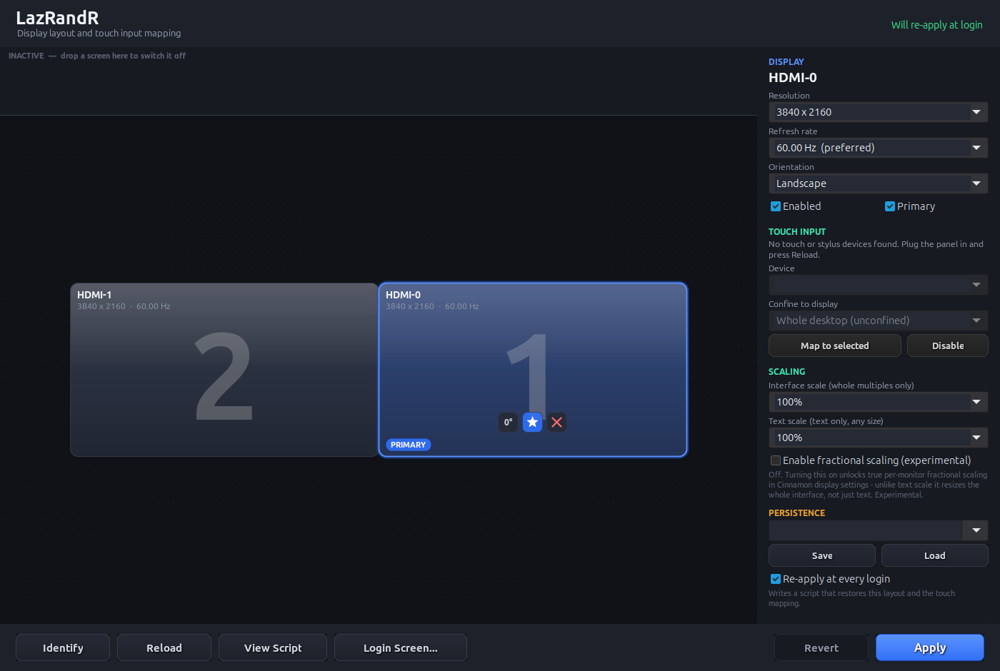
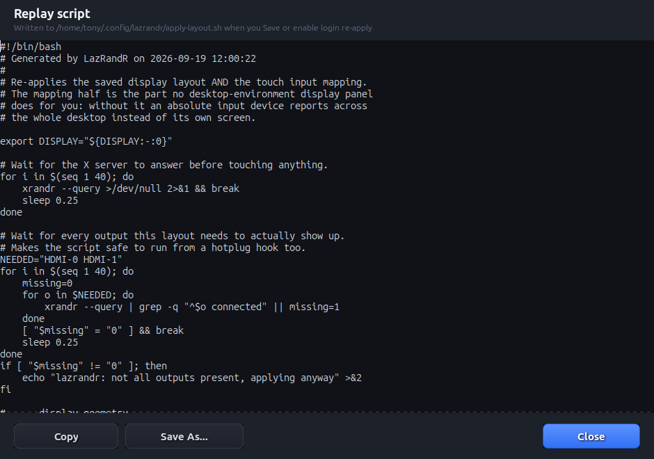

# LazRandR

A display layout tool for Linux/X11 that also **maps touchscreens to the right
monitor**, which no desktop environment's display panel does for you.

Written in Free Pascal with Lazarus (GTK3) and BGRABitmap. MIT licensed.



## The story

LazRandR started in 2021 as a way to carve one big monitor into several
*virtual* displays with `xrandr --setmonitor`, so windows would snap into them
like separate screens. It turned out Cinnamon, GNOME, MATE and friends ignore
XRandR monitors, so there was nothing underneath to honour them, and the
project sat.

Years later I plugged a small portable touchscreen in next to my two 4K
monitors on Linux Mint. The picture was fine, but touching it moved the cursor
on a completely different screen. X spreads touch input across the *whole*
desktop, and Mint's display settings have no way to tie a touchscreen to its
own monitor. Rotate the panel and the axes swap too.

So in 2026 the old layout editor was rewritten as a display **and touch
mapping** tool. More in [`docs/HISTORY.md`](docs/HISTORY.md).

## Features

- **Drag-and-drop layout** with snapping (hold `Alt` to place freely),
  resolution, refresh rate, rotation, primary and on/off per screen.
- **Touch mapping**: confine any touchscreen or pen to any monitor, correct
  under rotation.
- **Survives logout**: saved profiles plus a replay script and autostart entry
  that restore the layout *and* the touch mapping.
- **Login screen**: installs the same layout into LightDM or SDDM, so the
  greeter isn't mirrored.
- **Confirm or revert**: every change rolls back after 15 seconds unless you
  confirm it.
- **Also**: identify screens, reverse PRIME linking for panels on a second GPU,
  and interface, text and fractional scaling controls.



## Download

Get the prebuilt 64-bit binary from the
[latest release](https://github.com/TonyStone31/LazRandR/releases/latest),
unpack it and run `./lazrandr`.

You need an **X11** session (not Wayland), GTK3, `xrandr`, `xinput` and glibc
2.34+ (Linux Mint 21+, Ubuntu 22.04+, Debian 12+). Installing the login-screen
hook uses `pkexec`. GDM is not supported.

## Building

Needs Lazarus/FPC with GTK3 and the `BGRABitmapPack` and `BGRAControls`
packages. Open `lazrandr.lpi` in the IDE, or use the script with an
fpcupdeluxe-style install:

```bash
LAZ_ROOT=~/fpcupdeluxe ./build.sh   # optimised build
./build.sh --debug                  # checks, debug info, heaptrc
./run.sh                            # build if needed, then run
```

## More

- [`docs/TECHNICAL.md`](docs/TECHNICAL.md): how the touch matrix works, the
  login-screen race, a known Cinnamon panel quirk, code layout and build notes
- [`docs/HISTORY.md`](docs/HISTORY.md): the full timeline

## License

MIT, see [`LICENSE`](LICENSE). Use it, change it, share it.
